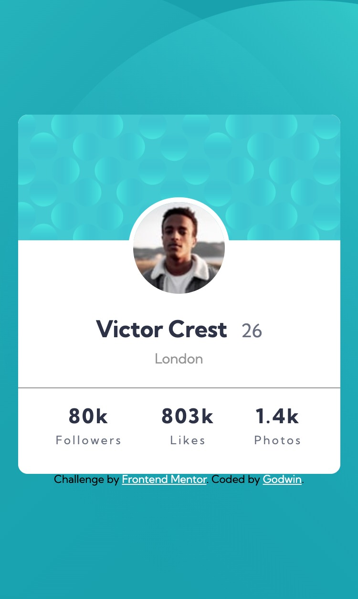
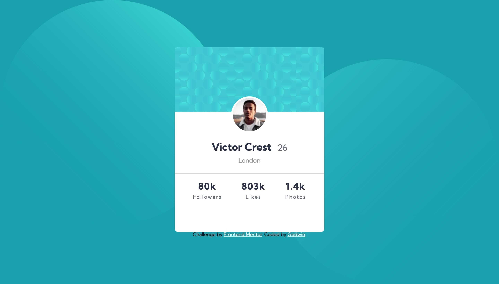

# Frontend Mentor - Profile card component solution

This is a solution to the [Profile card component challenge on Frontend Mentor](https://www.frontendmentor.io/challenges/profile-card-component-cfArpWshJ). Frontend Mentor challenges help you improve your coding skills by building realistic projects. 

## Table of contents

- [Overview](#overview)
  - [The challenge](#the-challenge)
  - [Screenshot](#screenshot)
  - [Links](#links)
- [My process](#my-process)
  - [Built with](#built-with)
  - [What I learned](#what-i-learned)
- [Author](#author)

## Overview

### The challenge

- Build out the project to the designs provided

### Screenshot
- Mobile View (width: 375px)

- Desktop View(width :1440px)

### Links

- Netlify URL: [Netlify URL](https://profile-component-card-preview.netlify.app/)
- Github URL: [Github URL](https://github.com/itadori-kun/Profile-card-component.git)

## My process

### Built with

- Semantic HTML5 markup
- CSS custom properties
- Flexbox
- Vs code extension

### What I learned
Learnt more about how to manipulate the images in the background.

## Author

- Frontend Mentor - [@itadori-kun](https://www.frontendmentor.io/profile/itadori-kun)
- Twitter - [@Godwincruise](https://www.twitter.com/Godwincruise)

